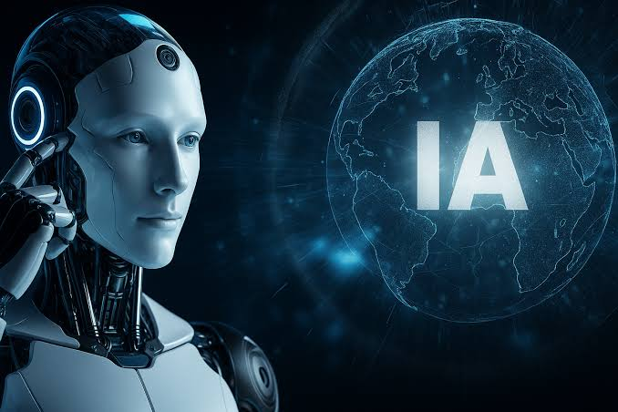

# 🤖 Inteligencia Artificial - 2026

  

> **Repositorio de actividades, prácticas y tareas de la materia de Inteligencia Artificial.**
> *Semestre: Agosto - Diciembre 2026*

---

## 📚 Sobre este repositorio
Este espacio está dedicado a documentar el progreso y las tareas realizadas durante el curso de de la materia Inteligencia Artificial. Aquí se cargarán los códigos, apuntes y proyectos desarrollados a lo largo del semestre.

## 📂 Contenido del curso
- 📁 **[Actividades Unidad 1](./Actividades%20Unidad%201)**: Introducción y primeros conceptos de IA.
- > **(Más unidades se irán agregando conforme avance el semestre)**

---
* Daniels John Altamirano Ramírez.*
